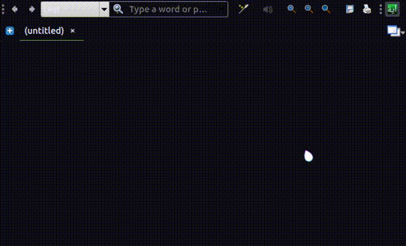

# Ayah Index | دليل الآيات [Stardict dictionary]
### متوافق مع ***Goldendict***, StarDict, ..
قاموس للبحث عن الآيات عبر اختصاراتها العددية مثلا `16:125` و العكس أيضا أي ادخال آية و الحصول على اختصارها

### التثبيت
 (Goldendict) قم فقط بوضع مجلد القاموس في مكان يتعرف عليه البرنامج المستعمل

### أدوات مستعملة
- http://qurandatabase.org/ (نسخة 18/05/2020)
- [remove_arabic_tashkeel](https://github.com/Ahmed-Salama96/remove_arabic_tashkeel)

### للقيام به
- [x] إنشاء نسخة إنجليزية : [Ayah index English](https://github.com/mossaybo/ayah-stardict-en)
